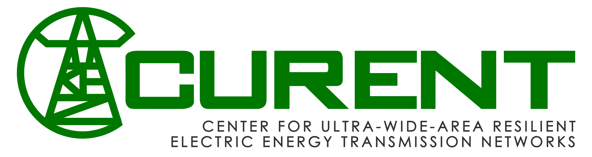

# CURENT Large-scale Testbed

The Large-scale Testbed (LTB) is a tightly integrated, closed-loop platform for rapid prototyping of power systems. **[ANDES](https://docs.andes.app/en/stable/index.html)**, **[AMS](https://github.com/jinningwang/ams)** (under development), **[DiME](https://ltbdime.readthedocs.io/en/latest/)**, and **[AGVis](https://agvis.readthedocs.io/en/latest/#what-is-agvis)** are four major independent sub packages of LTB that serve as a dynamic simulator, market simulator, distributed messaging environment, and grid visualizer, respectively. Towards a one-stop solution, these LTB packages can serve for both individual and federated use.

# Why LTB

LTB platform enables power system *dynamic simualiton*, *market simulation*, *geographical visualization*, *real-time simualtion*, and ***dispatch-dynamic co-simulaiton***.

*Getting trouble with dispatch in a dynamic simulation?* The interoperability of ANDES for scheduling supports secured dispatch in a dynamic simulation.

*Getting lost in the APIs of simulators?* Easy-to-use ANDES and AMS can be your last stop to prototype new algorithms and models.

*Looking for a geographical visualization?* AGVis allows geographical visualization with multiple options.

*Interested in a real-time closed-loop simulation?* LTB has integrated simulators and communication environments.

# Citing LTB

If you use LTB packages for research or consulting, we kindly request you to cite the following papers in your publication that uses LTB

> F. Li, K. Tomsovic and H. Cui, "A Large-Scale Testbed as a Virtual Power Grid: For Closed-Loop Controls in Research and Testing," in IEEE Power and Energy Magazine, vol. 18, no. 2, pp. 60-68, March-April 2020, doi: 10.1109/MPE.2019.2959054.

> H. Cui, F. Li and K. Tomsovic, "Hybrid Symbolic-Numeric Framework for Power System Modeling and Analysis," in IEEE Transactions on Power Systems, vol. 36, no. 2, pp. 1373-1384, March 2021, doi: 10.1109/TPWRS.2020.3017019.

> Parsly, N., Wang, J., West, N., Zhang, Q., Cui, H., & Li, F. (2022). "DiME and AGVIS A Distributed Messaging Environment and Geographical Visualizer for Large-scale Power System Simulation". arXiv. https://doi.org/https://arxiv.org/abs/2211.11990v1

# Sponsors

This work was supported in part by the Engineering Research Center Program of the National Science Foundation and the Department of Energy under NSF Award Number EEC-1041877 and the CURENT Industry Partnership Program.

# License

LTB is licensed under the [GPL v3 License](./LICENSE).
